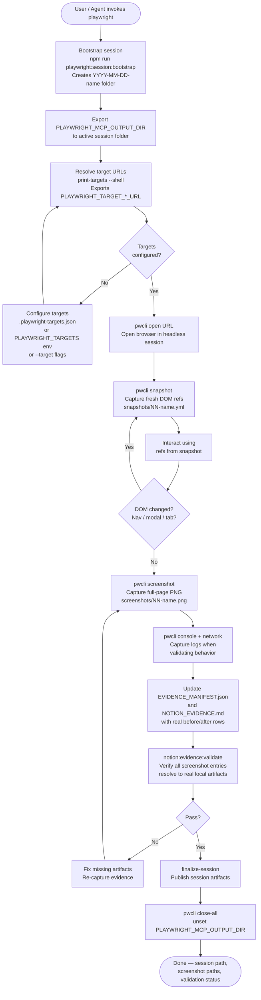

# playwright
A guarded Playwright CLI wrapper with deterministic artifact storage, config-driven target URL resolution, and structured evidence manifests. Use it when browser validation requires screenshot evidence, DOM snapshots, or artifacts that must be handed off to planning and Notion workflows.

## Install

The fastest cross-agent install path is the `skills` CLI:

```bash
npx skills add gg-skills/playwright
```

Drop this skill into a workspace as a Git submodule for pinned versions, or as a plain clone for latest `main`:

```bash
# Project-local, version-pinned:
git submodule add git@github.com:gg-skills/playwright.git .claude/skills/playwright

# OR project-local, latest main:
mkdir -p .claude/skills
git -C .claude/skills clone git@github.com:gg-skills/playwright.git

# OR user-level, available in every project on this machine:
mkdir -p ~/.claude/skills
git -C ~/.claude/skills clone git@github.com:gg-skills/playwright.git
```

Restart your agent or reload skills after installation. See the parent [`skills` catalog repo](https://github.com/gg-skills/skills) for the full catalog.

## When to use

- Validating UI behavior in a browser using Playwright CLI.
- A plan requires baseline or post-implementation screenshot evidence.
- Visual parity between app surfaces must be validated.
- Browser artifacts need structured storage under `/.playwright-sessions/`.
- Evidence must be handed off to Notion or planning workflows.
- `plan/SKILL.md` requests baseline or post-implementation browser evidence.

Skip it when the task can be verified with unit or API tests alone, when browser
validation is already covered by another dedicated test suite, or when the user
explicitly asks for manual inspection without screenshots.

## How it operates

### Inputs

| Input | Description |
|---|---|
| `--session-name` flag | Human-readable label for the session folder created under `/.playwright-sessions/YYYY-MM-DD-<name>/` |
| `.playwright-targets.json` | JSON file at the host project root mapping named keys to target URLs; consumed by `print-targets` |
| `PLAYWRIGHT_TARGETS` env var | Semicolon-delimited alternative to the config file: `WEBSITE=https://localhost:3000;API=https://localhost:4000` |
| `--target` flags | Per-invocation URL overrides passed directly to `print-playwright-targets.ts` |
| `PLAYWRIGHT_MCP_OUTPUT_DIR` | Must be exported (to the active session folder) before any `open` or `--filename` command |
| `PLAYWRIGHT_CLI_ALLOW_HEADED` | Set to `1` to unblock headed mode for manual debugging; headless is the default |

### Outputs

All artifacts land under `/.playwright-sessions/YYYY-MM-DD-<session-name>/`:

```
.playwright-sessions/YYYY-MM-DD-<name>/
├── snapshots/          ← DOM reference snapshots (.yml), one per interaction sequence
├── screenshots/        ← full-page PNGs captured after key states
├── state/              ← browser state files when saved
├── SUMMARY.md          ← scenario, expected/observed behavior, follow-up
├── EVIDENCE_MANIFEST.json  ← before/after evidence rows with source URLs
└── NOTION_EVIDENCE.md  ← validated draft ready for Notion handoff
```

### External commands

The TypeScript wrapper (`pwcli`) is the canonical entry point — it enforces session guardrails and routes artifacts to the active session folder:

```bash
# Set up pwcli helper (run once per shell)
REPO_ROOT="$(git rev-parse --show-toplevel)"
pwcli() { npx tsx "$REPO_ROOT/playwright/scripts/playwright-skill-cli.ts" cli "$@"; }

# Bootstrap a session
npm run playwright:session:bootstrap -- --session-name "<name>"

# Export session dir (required before open / --filename)
export PLAYWRIGHT_MCP_OUTPUT_DIR="$REPO_ROOT/.playwright-sessions/$(date +%F)-<name>"

# Resolve and export target URLs
eval "$(npx tsx playwright/scripts/playwright-skill-cli.ts print-targets --shell)"

# Browser interaction
pwcli open "$PLAYWRIGHT_TARGET_WEBSITE_URL"
pwcli -s=default snapshot --filename "snapshots/01-home.yml"
pwcli -s=default screenshot --filename "screenshots/01-home.png" --full-page
pwcli -s=default console
pwcli -s=default network

# Validate evidence, then finalize
npm run notion:evidence:validate -- --session "$PLAYWRIGHT_MCP_OUTPUT_DIR"
npx tsx playwright/scripts/playwright-skill-cli.ts finalize-session --session-dir "$PLAYWRIGHT_MCP_OUTPUT_DIR"

# Close sessions
pwcli close-all
unset PLAYWRIGHT_MCP_OUTPUT_DIR
```

### Side effects

- **Creates `/.playwright-sessions/` entries.** Each bootstrap call creates a timestamped folder with `SUMMARY.md`, `EVIDENCE_MANIFEST.json`, and `NOTION_EVIDENCE.md` drafts. These accumulate indefinitely — sweep manually.
- **No host `package.json` changes.** The skill does not modify or require changes to the host project's dependencies or scripts beyond the `playwright:session:bootstrap` npm script entry.
- **Validation is blocking.** `notion:evidence:validate` exits non-zero when any `NOTION_EVIDENCE.md` screenshot entry lacks a resolvable local artifact, preventing silent evidence gaps.

### Mode toggles

| Toggle | Effect |
|---|---|
| `PLAYWRIGHT_CLI_ALLOW_HEADED=1` | Unlocks `--headed` flag; default is headless |
| `print-targets --shell` | Exports `PLAYWRIGHT_TARGET_<NAME>_URL` variables for every configured target |
| `print-targets --json` | Prints resolved targets as JSON for programmatic use |
| `finalize-session --session-dir <path>` | Publishes session artifacts; validates completeness before handoff |
| `apply --dry-run` (evidence validate) | Validates manifests without writing; exits non-zero on missing artifacts |

## Operational flow



## Layout

```
.
├── SKILL.md                        ← entry point: workflow rules, non-negotiable policy, troubleshooting
├── tsconfig.json                   ← TypeScript config for scripts/ and tests/
├── agents/
│   └── openai.yaml                 ← IDE / agent descriptor
├── assets/                         ← skill icons (small SVG, large PNG)
├── references/                     ← load-on-demand long-form guidance
│   ├── cli-commands.md             ← full Playwright CLI command catalog by category
│   └── troubleshooting.md          ← session, ref, and setup failure guide
├── scripts/                        ← TypeScript CLI toolkit
│   ├── playwright-skill-cli.ts     ← unified CLI router (canonical entrypoint)
│   ├── playwright-cli.ts           ← guarded playwright-cli wrapper (enforces guardrails)
│   ├── playwright-session-bootstrap.ts     ← creates timestamped session directory
│   ├── playwright-evidence-manifest-init.ts ← initializes / refreshes EVIDENCE_MANIFEST.json
│   ├── finalize-playwright-session.ts       ← publishes completed session artifacts
│   ├── print-playwright-targets.ts          ← resolves and prints target URLs
│   ├── playwright-skill-cli-dispatch.ts     ← internal command dispatcher
│   └── lib/                        ← shared helpers (guardrails, session, commands, entry)
└── tests/
    └── playwright-session-scripts.unit.test.ts  ← regression tests for bootstrap + guardrail helpers
```

## Quick start

Read [`SKILL.md`](./SKILL.md) first — it carries the non-negotiable policy,
interaction rules, session template, common pitfalls, and the full reference
loading guide.

Minimal end-to-end validation run:

```bash
REPO_ROOT="$(git rev-parse --show-toplevel)"
pwcli() { npx tsx "$REPO_ROOT/playwright/scripts/playwright-skill-cli.ts" cli "$@"; }

# Create target config (once per project)
cat > .playwright-targets.json << 'EOF'
{ "targets": { "WEBSITE": "https://localhost:3000" } }
EOF

# Bootstrap + open + capture
npm run playwright:session:bootstrap -- --session-name "smoke-test"
SESSION_ABS="$REPO_ROOT/.playwright-sessions/$(date +%F)-smoke-test"
export PLAYWRIGHT_MCP_OUTPUT_DIR="$SESSION_ABS"
eval "$(npx tsx playwright/scripts/playwright-skill-cli.ts print-targets --shell)"

pwcli open "$PLAYWRIGHT_TARGET_WEBSITE_URL"
pwcli -s=default snapshot --filename "snapshots/01-home.yml"
pwcli -s=default screenshot --filename "screenshots/01-home.png" --full-page

# Validate + finalize
npm run notion:evidence:validate -- --session "$SESSION_ABS"
npx tsx playwright/scripts/playwright-skill-cli.ts finalize-session --session-dir "$SESSION_ABS"

pwcli close-all
unset PLAYWRIGHT_MCP_OUTPUT_DIR
```

## Resources

- [`SKILL.md`](./SKILL.md) — full operating guidance, non-negotiable policy, session template, pitfalls.
- [`references/cli-commands.md`](./references/cli-commands.md) — complete Playwright CLI command catalog organized by category.
- [`references/troubleshooting.md`](./references/troubleshooting.md) — detailed guide for session, ref, and setup failures.
- [`scripts/playwright-skill-cli.ts`](./scripts/playwright-skill-cli.ts) — unified CLI router; canonical entrypoint for all subcommands.
- [`agents/openai.yaml`](./agents/openai.yaml) — IDE / agent descriptor.
- Upstream Playwright docs: https://playwright.dev/docs/intro

## Caveats

- **`PLAYWRIGHT_MCP_OUTPUT_DIR` must be exported before `open`.** The wrapper hard-fails without it. Always run the bootstrap export step first — see the Session Template in `SKILL.md`.
- **Use `pwcli`, not raw `playwright-cli`.** The raw global binary bypasses session guardrails and can scatter artifacts to `.playwright-cli/` or the current directory instead of the session folder.
- **Snapshot before every interaction.** Refs become stale after navigation, modal changes, or tab switches. Re-snapshot after every significant DOM change before issuing interaction commands.
- **`--headed` is blocked by default.** Set `PLAYWRIGHT_CLI_ALLOW_HEADED=1` only for explicit manual debugging runs.
- **Artifact paths must include a subfolder.** Root-level `--filename` paths are rejected for safety. Always use `screenshots/...` or `snapshots/...` sub-paths.
- **Target config is consumer-supplied.** This skill ships no default URLs. Consumers must provide `.playwright-targets.json` (or env var / flags) before running `print-targets`.
- **Session folders accumulate indefinitely.** Nothing auto-cleans `/.playwright-sessions/`. Sweep it manually after evidence is published.
- **Never reconstruct CLI flags or setup steps from memory.** Always read `references/cli-commands.md` or `references/troubleshooting.md` first — subtle flag combinations and ordering matter.
